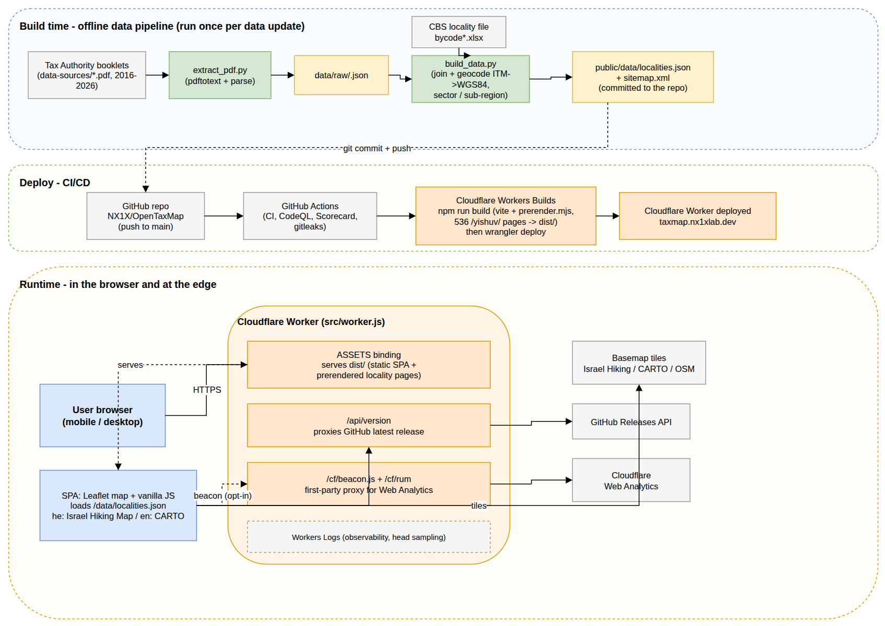

<p align="center">
  
</p>

<h1 align="center">OpenTaxMap</h1>

[](https://github.com/NX1X/OpenTaxMap/actions/workflows/ci.yml)
[](https://github.com/NX1X/OpenTaxMap/actions/workflows/codeql.yml)
[](https://github.com/NX1X/OpenTaxMap/actions/workflows/release.yml)
[](https://taxmap.nx1xlab.dev)
<br>
[](LICENSE)
[](https://taxmap.nx1xlab.dev)
[](https://github.com/NX1X/OpenTaxMap/commits/main)
[](https://github.com/NX1X/OpenTaxMap/stargazers)
[](https://github.com/NX1X/OpenTaxMap)
[](https://nx1xlab.dev)
[](https://nx1xlab.dev/nxtools)

**מפת היישובים המזכים בהטבת מס הכנסה** - an interactive map of every Israeli
locality whose residents are eligible for the periphery income-tax credit
("yishuvim mutavim", Section 11 of the Income Tax Ordinance), covering tax
years 2016-2026.

Live: https://taxmap.nx1xlab.dev

> Part of the [NXTools Collection](https://nx1xlab.dev/nxtools) by NX1X.

## Features

- All ~490 eligible localities on one map, color-coded by credit rate (7%-20%)
- Full benefit history per locality (rate + annual income cap, 2016-2026)
- Search (Hebrew and English names), filters by tax year, sector
  (Jewish / Arab / Druze / mixed), region, sub-region (Upper & Lower Galilee,
  Western Galilee, Golan, Gaza Envelope, Western & Eastern Negev,
  Eilat & Arava, Jordan Valley and more), local authority, and credit rate
- Hebrew (RTL) and English (LTR) interface, light and dark themes
- Accessibility: WCAG 2.1 AA-oriented - keyboard navigation, screen-reader
  support, accessibility menu (text size, high contrast, reduced motion,
  underlined links), full text list alongside the map
- Shareable URLs - filters and language are reflected in query parameters

## Architecture



An offline data pipeline turns the Tax Authority booklets into
`localities.json`, which is committed to the repo. On push to `main`,
Cloudflare Workers Builds runs the Vite build (with per-locality prerendering)
and deploys a single Cloudflare Worker that serves the static SPA and proxies
Web Analytics and the version check first-party. Editable source:
[design/architecture.drawio](design/architecture.drawio).

## Data pipeline

Source of truth is the Israel Tax Authority's annual deduction booklets
(`data-sources/tax-map-<year>.pdf`), joined with the CBS locality registry:

```
data-sources/tax-map-*.pdf
        │  scripts/extract_pdf.py   (pdftotext + table parsing)
        ▼
data/raw/<year>.json               {name, code, rate, cap}
        │  scripts/build_data.py   (join with data/cbs/bycode2024.xlsx,
        │                           ITM→WGS84 via pyproj, sector/district,
        ▼                           manual overrides in data/overrides.json)
public/data/localities.json        one record per locality, benefits keyed by year
```

Rebuild the dataset (requires the `pdftotext` binary from poppler-utils):

```bash
pip install --require-hashes -r scripts/requirements.txt
npm run data
```

Notes baked into the data:

- 2023 amendment-256 localities (Tiberias, Akko, Sakhnin, Tamra and other
  Galilee localities) carry the mid-year rate change as an `alt` entry.
- Eilat is included with its separate benefit under the Eilat Free Trade Zone
  Law (10%, income produced in the Eilat region only).
- Newly founded localities missing from the CBS file (Ramat Trump, Aduraim,
  Yonadav, Kedem Arava, Bitron) are geocoded via OSM/Wikipedia in
  `data/overrides.json`.

## Development

```bash
npm install
npm run dev       # local dev server
npm run build     # production build to dist/
npm run preview   # serve the production build
```

Stack: Vite, vanilla JS, Leaflet. Basemaps: Israel Hiking Map (Hebrew) and
CARTO Voyager (English). No backend - the site is fully static.

## Deployment

The site is fully static, so both Cloudflare targets work. Workers is the
default here because the first-party analytics proxy (below) needs a small
Worker script; on Pages the same can be done with a Pages Function.

- **Workers** (configured in `wrangler.jsonc`, uses `src/worker.js`). Deployed
  by Cloudflare Workers Builds, which pulls this repository and builds on push
  to `main`; no deploy credentials are stored in GitHub. Manual deploy:
  `npm run build && npx wrangler deploy`. Requires Node 22 (see `.nvmrc`).
- **Pages**: build command `npm run build`, output directory `dist`. Without a
  Function, drop the analytics proxy and use Cloudflare's automatic Web
  Analytics injection instead.

Security headers and caching are configured in `public/_headers`.

### Analytics (Cloudflare Web Analytics, first-party)

Privacy-friendly, cookieless, and served first-party so ad/script blockers do
not strip it and the CSP stays at `'self'`:

1. In the Cloudflare dashboard, add a Web Analytics site and copy its **token**
   (a public site token, safe to expose).
2. Build with it set: `CF_ANALYTICS_TOKEN=xxxx npm run build`. The beacon is
   injected into the HTML pointing at `/cf/beacon.js`; `src/worker.js` proxies
   both the beacon script and its reporting endpoint (`/cf/rum`) to Cloudflare.
3. With no token set, nothing is injected. No third-party requests are made.

## Contributing

Found a mistake in the data? Open a
[data error issue](https://github.com/NX1X/OpenTaxMap/issues/new/choose) or use
the [contact form](https://nx1xlab.dev/contact). See
[CONTRIBUTING.md](CONTRIBUTING.md) for development setup. The source PDFs are
available in [`data-sources/`](data-sources/).

## Data sources & credits

- [Israel Tax Authority deduction booklets](https://www.gov.il/BlobFolder/generalpage/income-tax-monthly-deductions-booklet/he/generalInformation_income-tax-monthly-deductions-booklet_monthly-deductions-booklet-2026.pdf) - eligible-locality lists
- [CBS locality file](https://www.cbs.gov.il/) - names, codes, districts, population, coordinates
- [Kol Zchut](https://www.kolzchut.org.il/he/זיכוי_ממס_הכנסה_לתושבים_בפריפריה) - eligibility conditions
- [OpenStreetMap](https://www.openstreetmap.org/) contributors and [CARTO](https://carto.com/) - base maps

This site is an independent reference tool, not tax advice, and is not
affiliated with any government body. The binding text is the Tax Authority's
publications.

## License

Code licensed under the [Apache License 2.0](LICENSE).
