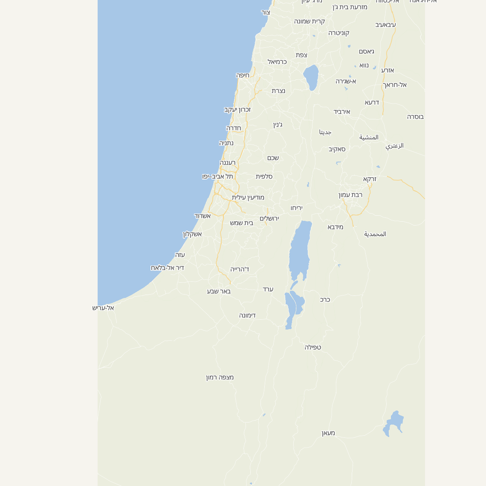
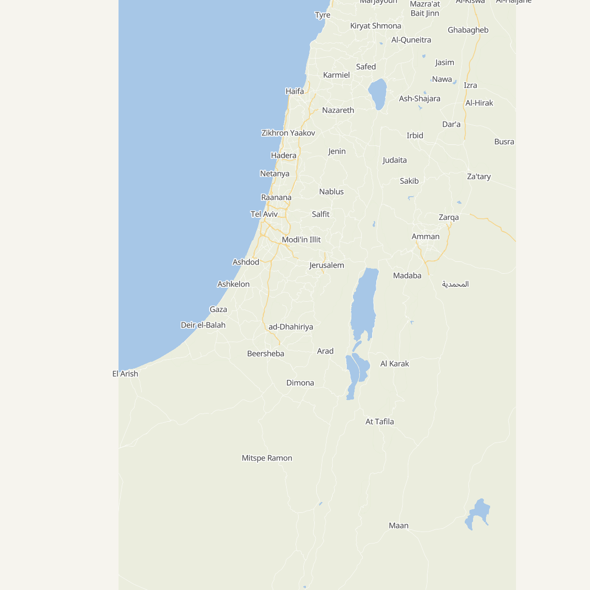

# MapLibre + Protomaps basemap prototype (v0.3.0)

Proof-of-concept for replacing Leaflet + Israel Hiking Map with a self-hosted
vector basemap. Verified working:

- Self-hosted Israel PMTiles (extracted from the Protomaps global build with
  `scripts/build-tiles.sh`) rendered by MapLibre GL.
- Clean style authored in-house: places, roads, water. **No boundaries layer**,
  so no green line / 67 border.
- Labels follow the UI language: Hebrew (`name:he`) with the RTL text plugin
  for correct shaping, English (`name:en`).

`prototype.html` is a standalone page (loads MapLibre + pmtiles from a CDN and
a locally-served `israel.pmtiles`). It is a reference only, not wired into the
app. The production integration (markers, popups, locate, language switch,
Area A/B/C overlay, R2 hosting, self-hosted glyphs, CSP) is the v0.3.0 work in
ROADMAP.md.

## Hosting

The Israel PMTiles is ~22 MB at zoom 12, ~45 MB at 13, ~90 MB at 14. Workers
static assets cap at 25 MiB per file, so the tile file is served from
Cloudflare R2 (no cap, HTTP range supported). Clients range-fetch only the few
KB of tiles they view, so file size affects hosting only, not user bandwidth.
